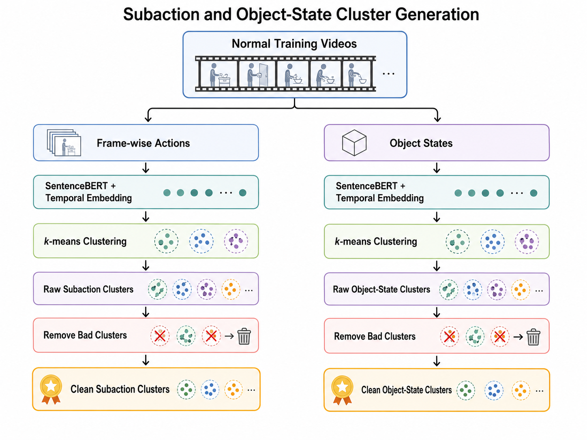
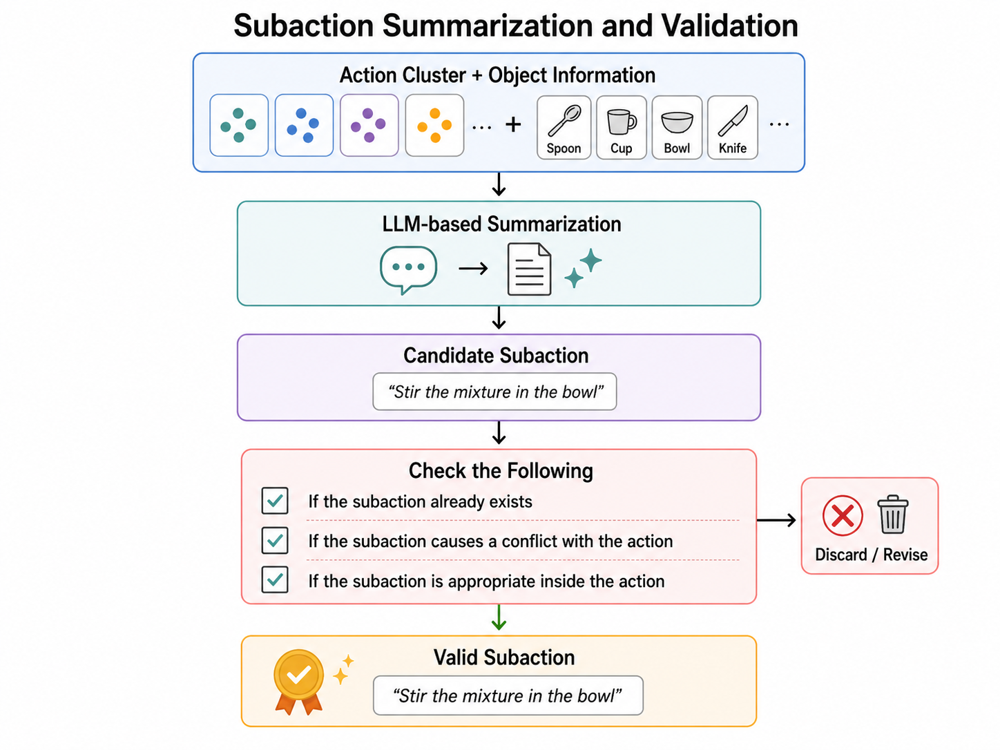
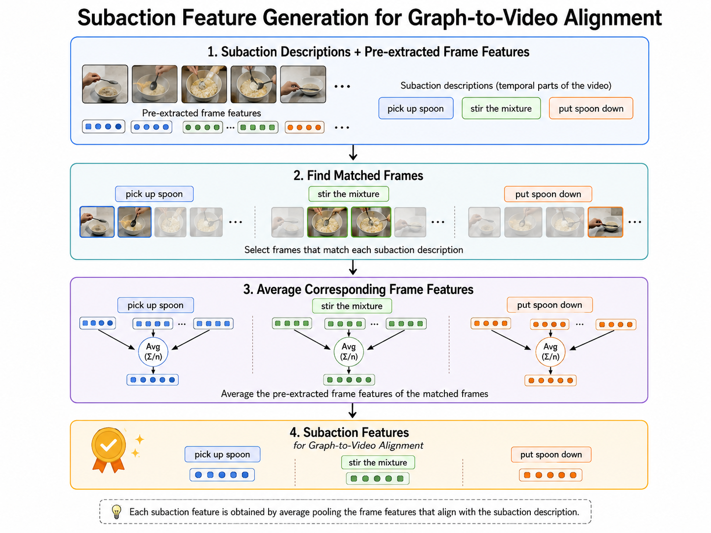
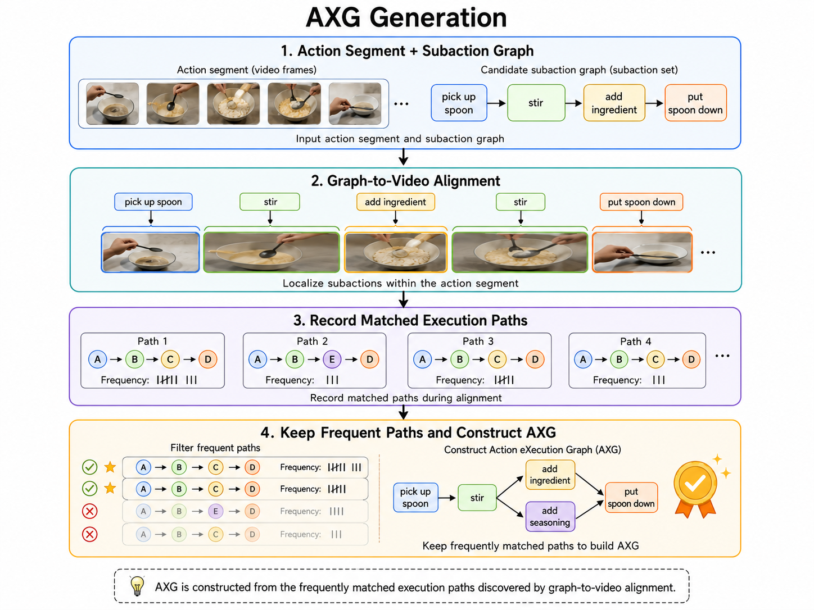
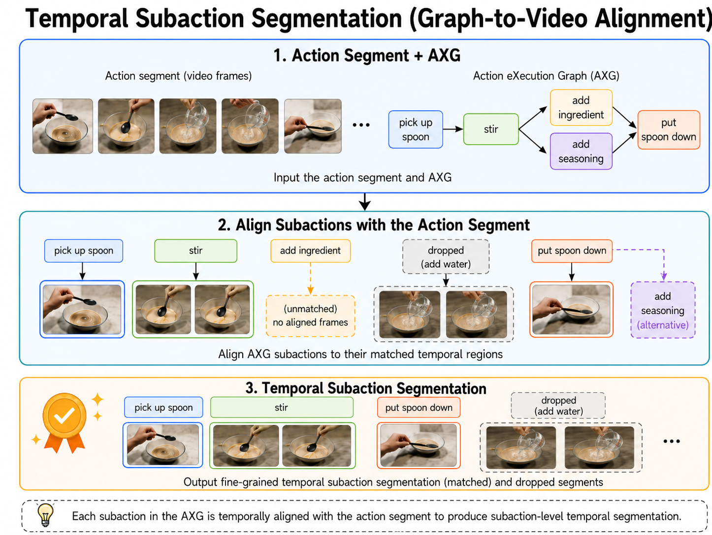

# AXG-Reasoner
This is the official implementation of our CVPR2026 paper, [AXG-Reasoner: Error Detection and Explanation in Long Task Videos with Vision–Language Models](https://openaccess.thecvf.com/content/CVPR2026/papers/Lee_AXG-Reasoner_Error_Detection_and_Explanation_in_Long_Task_Videos_with_CVPR_2026_paper.pdf)

If our work is helpful to your research, please consider citing our paper:
```
@InProceedings{Lee_2026_CVPR,
    author    = {Lee, Shih-Po and Elhamifar, Ehsan},
    title     = {AXG-Reasoner: Error Detection and Explanation in Long Task Videos with Vision-Language Models},
    booktitle = {Proceedings of the IEEE/CVF Conference on Computer Vision and Pattern Recognition (CVPR)},
    month     = {June},
    year      = {2026},
    pages     = {3421-3431}
}
```

## Preparation
### Download frames and pre-extracted features
To download the EgoPER and CaptainCook4D dataset, please visit [GTG2Vid](https://github.com/robert80203/GTG2Vid)

### Download labels, splits, and frame-wise captions, and other files
To download the EgoPER and CaptainCook4D datasets, please send a request to lee.shih@northeastern.edu with the following information:

- Your Full Name
- Institution/Organization
- Advisor/Supervisor Name
- Current Position/Title
- Emaill Address (with institutional domain name)
- Purpose (e.g., download the dataset or pre-trained weight or both, for research purpose or others)

### Data structure
Create a data/ folder with the following structure and move/name directories accordingly.
- `vc_v_features_10fps/`: pre-extracted frame-wise features
- `labels_10fps/`: frame-wise labels
- `action_object_state/`: frame-wise captions
- `frames_10fps`: frame-wise frames
- `clean_action_dict.json`: denoise action description

```
- data
    - clean_action_dict.json
    - EgoPER
        - action2idx.json
        - coffee/
            - vc_v_features_10fps/
            - labels_10fps/
            - frames_10fps/
            - action_object_state/
            - training.txt
            - test.txt
        - oatmeal/
        - pinwheels/
        - tea/
        - quesadilla/
    - CaptainCook4D
        - action2idx.json
        - breakfastburritos/
            - vc_v_features_10fps/
            - labels_10fps/
            - frames_10fps/
            - action_object_state/
            - training.txt
            - test.txt
        - cucumberraita/
        - microwaveeggsandwich/
        - ramen/
        - spicedhotchocolate/
```
### Create your own environment
- Please setup your own environment with the following requirements according to your hardware and firmware version

#### For training
Ensure your environment can 
- `from sentence_transformers import SentenceTransformer`
- `from transformers import AutoModelForCausalLM, AutoTokenizer`. We use `Qwen2.5-32B-Instruct` from hugging face.

#### For testing
Ensure your environment can
- `from transformers import AutoProcessor`
- `from vllm import LLM, SamplingParams`. For more information, please visit [vllm](https://vllm.ai/)

## Training
- **Activate your environment before running.** and create `output/`
- **Ensure the feature path in the code matches your local path**
- Change `--dataset` and `--task` accordingly.
- Default numer of frames: 3
- Default number of clusters: clust_config.json
### Subaction generation
#### 
- Embed frame-wise actions and object states with SentenceBERT and their temporal embeddings.
- Use k-means to generate subaction and object clusters.
- Remove bad clusters for both subaction and object clusters.
- Results will be saved in `output/`, named `subactions_{num_clusters}_clust/` and `obj_state_{num_clusters}_clust`
```shell
python generate_subactions_objects.py --dataset EgoPER --task quesadilla
```
#### 
- Use LLMs to summarize actions in a cluster with objects information to obtain the subaction.
- Need to check the followings:
    - If the subaction already exists.
    - If the subaction causes a conflict with the action.
    - It the subaction is appropriate inside the action.
- Results will be saved in `output/`, named `/summarized_subactions_{num_clusters_dict[task]}_clust/`
```shell
python summarize_subactions.py --dataset EgoPER --task quesadilla
```

#### 
- Perform average over the corresponding pre-extracted frame features
    - The frames that match the subaction descriptions
- Results will be saved in `output/`, named `v_subaction_features_{num_clusters_dict[task]}_clust`
```shell
python generate_subaction_features.py --dataset EgoPER --task quesadilla
```

### 
- Perform graph-to-video alignment to localize the subactions within an action segment.
- Record the matched execution paths during the process.
- Keep the frequetly matched paths and construct AXG.
- Results will be saved in `output/`, named `axg_{num_clusters_dict[task]}_clust`
```shell
python build_axg.py --dataset EgoPER --task quesadilla
```

## Testing
- (optional) If you would like to use predicted TAS, create a `tas_output/` and put the downloaded or your own tas inside.
### Error reasoning inference
#### 
- Align subactions in the AXG with the action segment.
    - You will obtain matched subactions and dropped ones.
    - Matched subactions are considered as potentially correct.
    - Dropped subactions are considered as potentially erroneous.
- Results will be saved in `output/`, named `data_for_vlm_{num_clusters_dict[task]}_clust_{tas_backbone}`
- `--tas_backbone` can be either `gt`, `gtg2vid`, `fact`, or `egoped`
    - [GTG2Vid](https://openaccess.thecvf.com/content/ICCV2025/papers/Lee_Error_Recognition_in_Procedural_Videos_using_Generalized_Task_Graph_ICCV_2025_paper.pdf)
    - [FACT](https://openaccess.thecvf.com/content/CVPR2024/papers/Lu_FACT_Frame-Action_Cross-Attention_Temporal_Modeling_for_Efficient_Action_Segmentation_CVPR_2024_paper.pdf)
    - [EgoPED](https://openaccess.thecvf.com/content/CVPR2024/papers/Lee_Error_Detection_in_Egocentric_Procedural_Task_Videos_CVPR_2024_paper.pdf)
```shell
python axg2vid.py --dataset EgoPER --task quesadilla
```
#### Error Reasoning
- Activate your vllm environment
- `cd vllm`
- Run VLMs with prompts (subactions + actions, whether the segment is dropped) and selected frames
- Results will be saved in `output/`, named `error_reasoning_{num_clusters_dict[task]}_clust_{tas_backbone}_{num_sampling_frames}f`
```shell
python run_axg-reasoner.py --dataset EgoPER --task quesadilla --numf 3
```

### Evaluation metrics
#### Error detection
- Evaluate the results on F1@10, F1@25, and F1@50 regarding correct and error segments.
```shell
python evaluate_error_detection.py --dataset EgoPER --task quesadilla
```

#### Error explanation
- Evaluate the results with LLMs and NLP metrics.
```shell
python evaluate_error_explanation.py --dataset EgoPER --task quesadilla
python evaluate_error_explanation.py --dataset EgoPER --task quesadilla --eval
```
